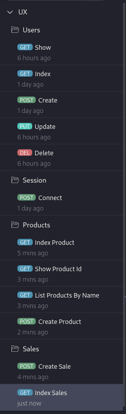
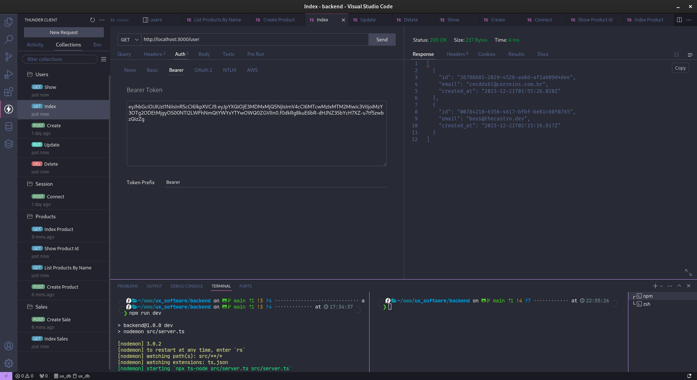
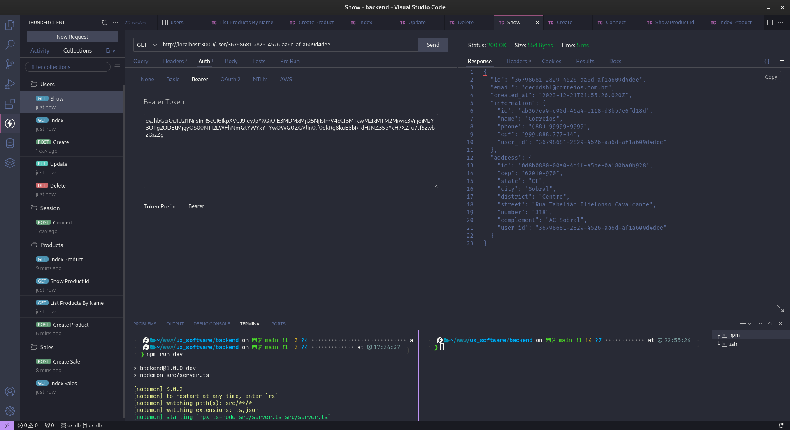
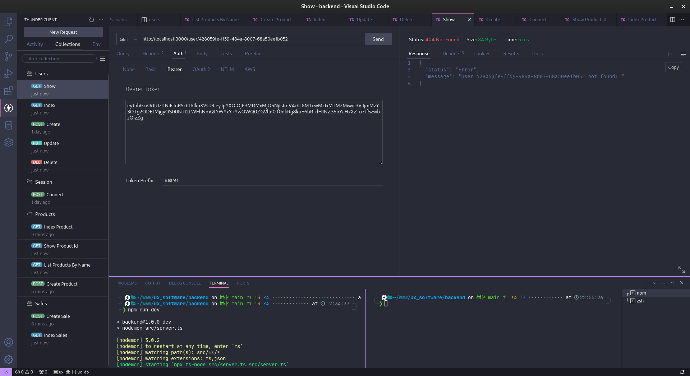
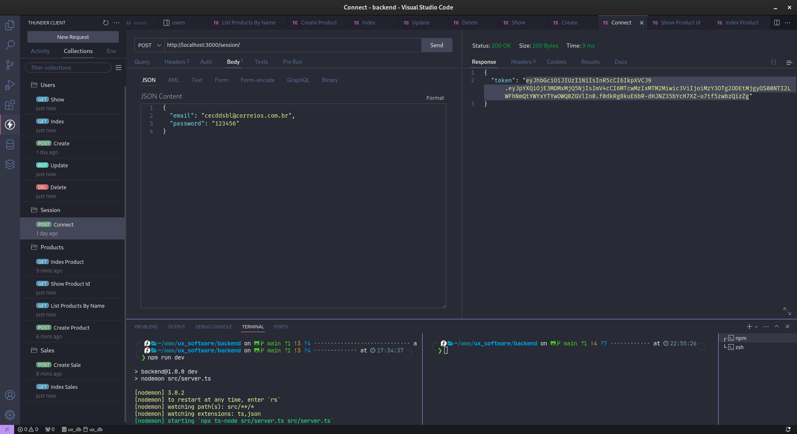
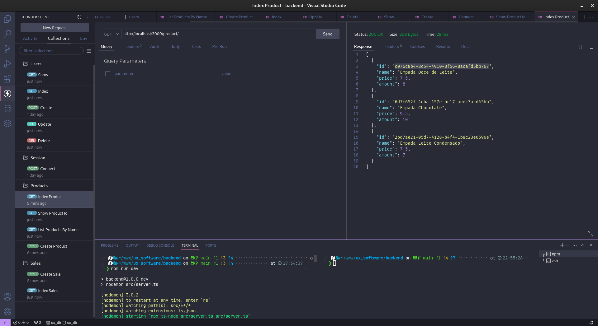
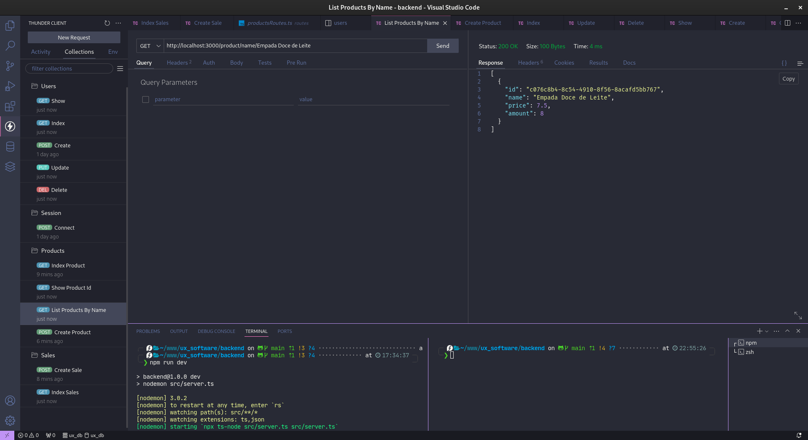
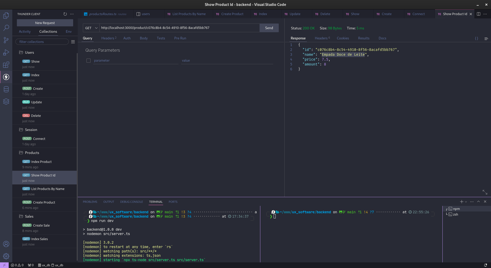
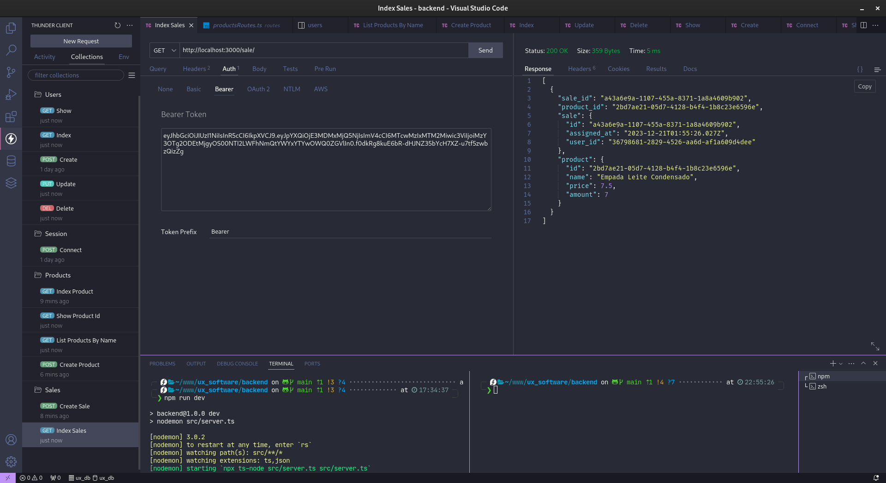

# Menu - UX_Foods

Desafio Cardápio Digital para a empresa UX Software.

Stacks:

- TypeScript
- Node.js
- ReactJS
- Prisma ORM

Algumas Features:
[x] CRUD Usuarios
[x] Autenticação
[x] Validação de Entrada
[x] Mascaras

### Users

Users Index

Users Show

Users Show Error

### Session

Create Session

### Products

Products Index

Products List Name

Products Show By Id

### Sales

Sales Index

